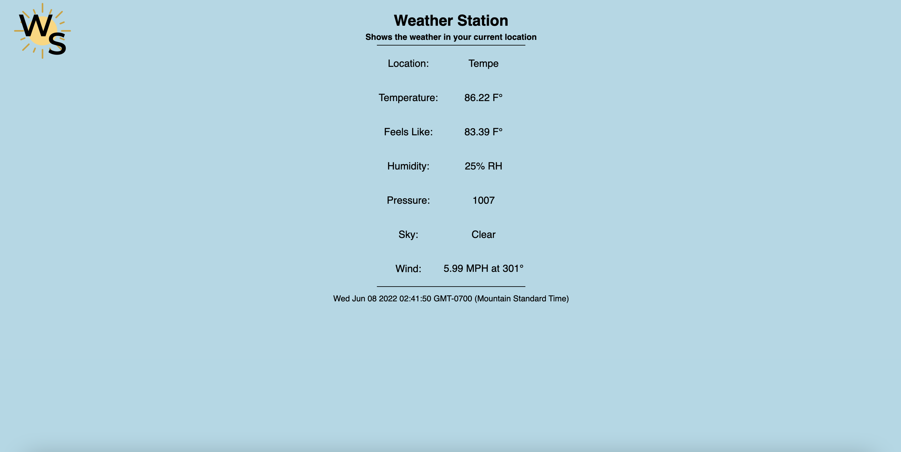

# Weather Station

This web app uses an OpenWeatherMap API to find data about the weather at your current Lat and Long. This project required me to decode JSON files and write functions to fetch the data. I would be happy to hear any potential updates I could make to improve this project! 

## Example of Software

